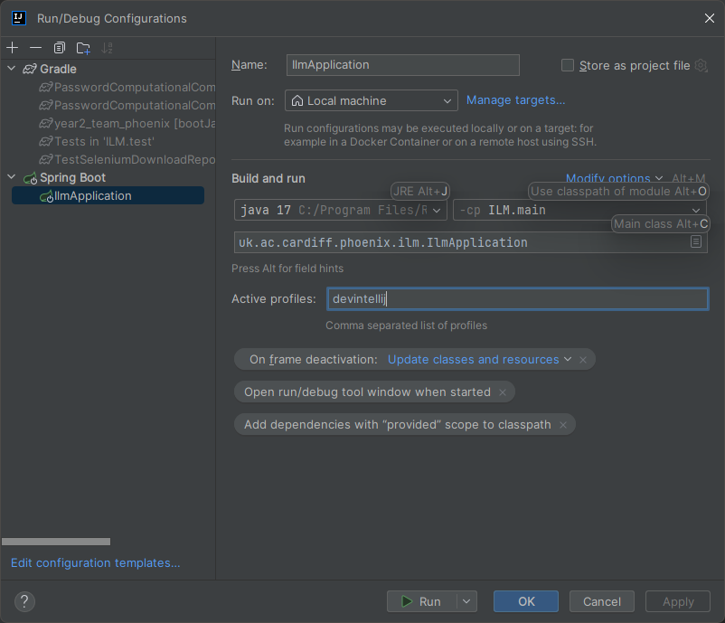

# README

How to run

Requires Java 17

Make sure you have a mariadb running with an empty ILM schema ("CREATE DATABASE ILM; commit;")

Set an environmental password for the database
DB_PASSWORD={your password}

run the GRADLE task 'bootRun' to build the jar

run jar from the command line with
```bash
java -jar -Dspring.profiles.active=dev build/libs/ilm-0.0.1-SNAPSHOT.jar
```

or if you need to include your db passwrod
```bash
java -jar -Dspring.profiles.active=dev -DB_PASSWORD={your password} build/libs/ilm-0.0.1-SNAPSHOT.jar
```

To run from intellij run with this profile, as intellij has alot of overhead this reduces password complexity to prevent slowdown 
devintellij




## INITAL SETUP

### Database

1. Create mariadb database, schema named 'ILM'


### Profiles and user accounts

Profile "**dev**" and "**devintellij**" have the following user account set up in the initial database

When in these 'dev' profiles database will be created from uk/ac/cardiff/phoenix/ilm/developmentConfig/DevDatabaseInit.java 
and uk/ac/cardiff/phoenix/ilm/developmentConfig/UploadedFilesDatabaseInit.java

username: su@su.com
password: password

This a super user and is configured to have access to everything - useful in dev and in setting up the app for the first
time with customer.
The password must  be changed in production as soon as the app is installed

username: admin@example.com
password: passwordthatchromewillsave

This is a user with admin privilages, such as file upload and report generation

username: john.tutor@example.com
password: password

This is a user designed for tutor interaction i.e. non administration - shouldn't be allwoed data upload or report generation 


Profile **test** has a reduced database size useful for use in automation testing

A production profile is not yet complete - this needs further consideration regarding initial user accounts and password
safety

database is built from this config uk/ac/cardiff/phoenix/ilm/developmentConfig/TestDatabaseInit.java


## Security


### User and roles and permissions
Users can have roles
Roles can have permissions
permissions can be granted to roles
permissions are not mutually exclusive - a user can have 2 roles which have the same permission
NOTE: what spring security calls roles (eg. hasRole(), we are calling permissions, sorry


### Adding roles and using
If you are building a new feature for a type of user, you can add the route to SecurityConfiguration.java
If you need to test the new permission, add a user with this role to DevDatabaseInit
Example
```
 .requestMatchers ("/tutor/").hasRole("VIEW_TUTOR_PAGE").allowedMethods("GET")
 .RequestMatchers ("/tutor/schedule_workshop").hasRole("TUTOR_SCHEDULE_WORKSHOP").allowedMethods("PUT")
 ```

```java
            Set<RolePermission> TUTORPermissions = Stream.of(
                    "VIEW_TUTOR_PAGE", "TUTOR_SCHEDULE_WORKSHOP")
                    .map(rolePermissionService::addPermission)
                    .collect(Collectors.toSet());

            UserRole TUTORRole = userRoleService.addUserRole("TUTOR");
            userRoleService.addPermissionToRole(TUTORRole, TUTORPermissions);

            // Populate the database with development data
            User UserTutor = new User(1, "John", "Tutor", "john.tutor@example.com");
            userService.addUser(UserTutor);
            userService.changePassword(UserTutor, "password");
            userService.addRole(UserTutor, TUTORRole);
            System.out.println(UserTutor);
```

### Thymleaf and security
You can show or hide elements in thymeleaf using the sec:authorize tag
This can be done on logged/not logged in basis, or role basis

Example: You could add the tag
```html
sec:authorize="hasRole('VIEW_TUTOR_PAGE')"
```
to an element in the NAVBAR and it would only be displayed to user with this permission
